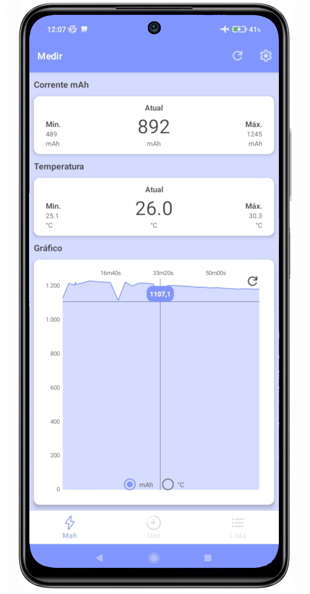
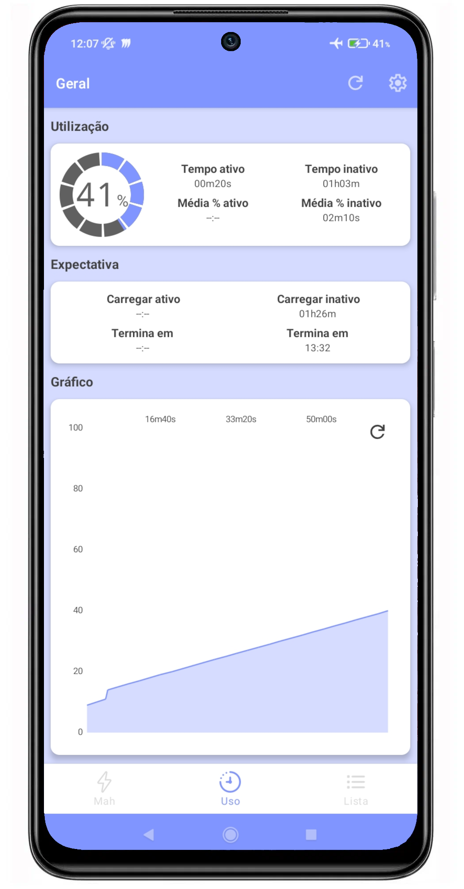
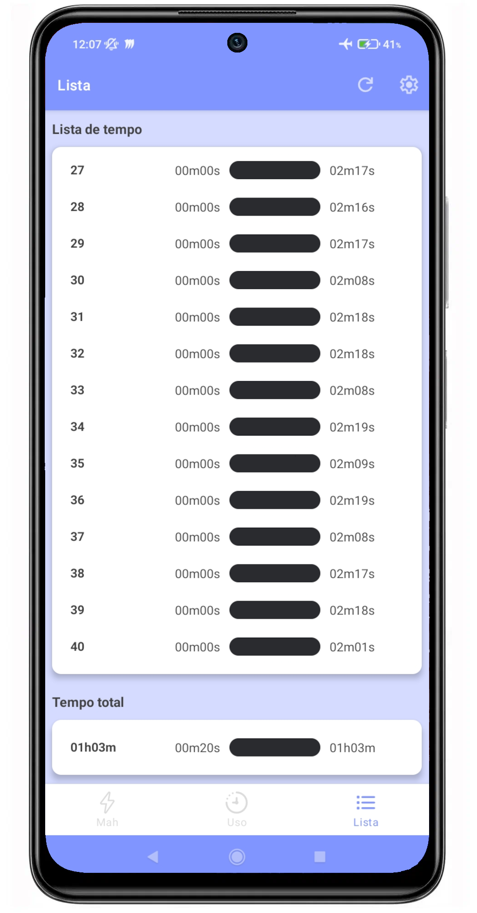

#  MDT-Battery
The MDT Battery app provides detailed insights into your device's battery usage and performance. It continuously monitors and records metrics like current (mAh), temperature, and usage patterns, offering a comprehensive overview of battery health. The app features graphical data displays, alerts, and predictions.
<p align="center">  
    
    
    
</p>  


## Used third-party libraries

- Circle Progress View -> MIT License -> [Circle-Progress-View](https://github.com/jakob-grabner/Circle-Progress-View?tab=MIT-1-ov-file)
- MP Android Chart -> Apache License 2.0 -> [MPAndroidChart](https://github.com/PhilJay/MPAndroidChart?tab=License-1-ov-file)

# License
This project is licensed under the [MIT license](https://opensource.org/license/mit).
```  
MIT License   
  
Copyright (c) 2024 Giovane Borges(GmacSpm) <https://github.com/GmacSpm>  
  
Permission is hereby granted, free of charge, to any person obtaining a copy  
of this software and associated documentation files (the "Software"), to deal  
in the Software without restriction, including without limitation the rights  
to use, copy, modify, merge, publish, distribute, sublicense, and/or sell  
copies of the Software, and to permit persons to whom the Software is  
furnished to do so, subject to the following conditions:  
  
The above copyright notice and this permission notice shall be included in all  
copies or substantial portions of the Software.  
  
THE SOFTWARE IS PROVIDED "AS IS", WITHOUT WARRANTY OF ANY KIND, EXPRESS OR  
IMPLIED, INCLUDING BUT NOT LIMITED TO THE WARRANTIES OF MERCHANTABILITY,  
FITNESS FOR A PARTICULAR PURPOSE AND NONINFRINGEMENT. IN NO EVENT SHALL THE  
AUTHORS OR COPYRIGHT HOLDERS BE LIABLE FOR ANY CLAIM, DAMAGES OR OTHER  
LIABILITY, WHETHER IN AN ACTION OF CONTRACT, TORT OR OTHERWISE, ARISING FROM,  
OUT OF OR IN CONNECTION WITH THE SOFTWARE OR THE USE OR OTHER DEALINGS IN THE  
SOFTWARE.  
```
